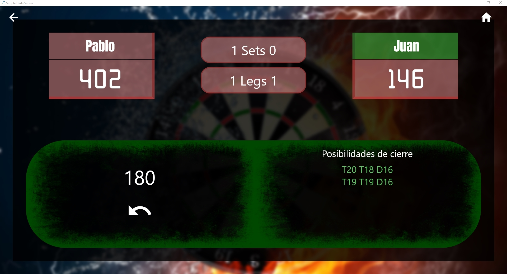
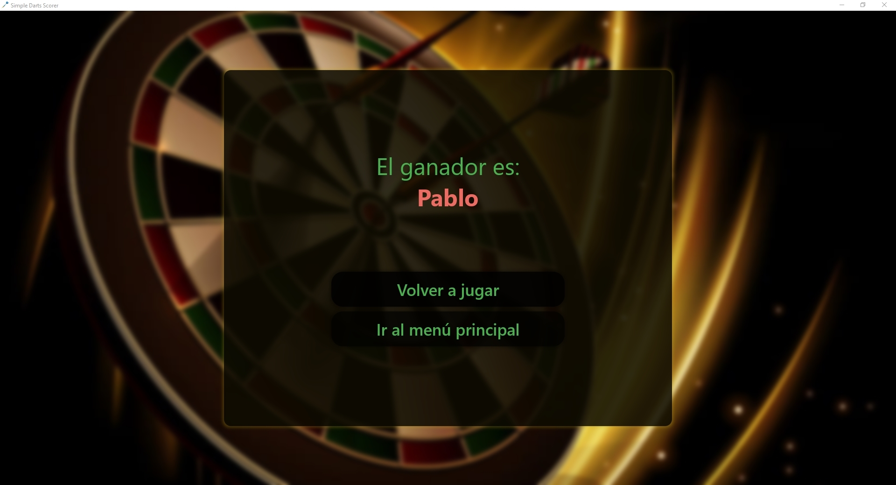

# Simple Darts Scorer

## Características
 - Posibilidad de gestionar una partida de dardos 501 entre 2 jugadores
 - Muestra por pantalla todas las posibilidades de cierre
 - Sistema de guardado de partida automática y posibilidad de continuarla
 - Historial de partidas

## Funcionamiento
Descarga el instalador de la aplicación en releases e instálala para poder ejecutarla

## Capturas de pantalla

