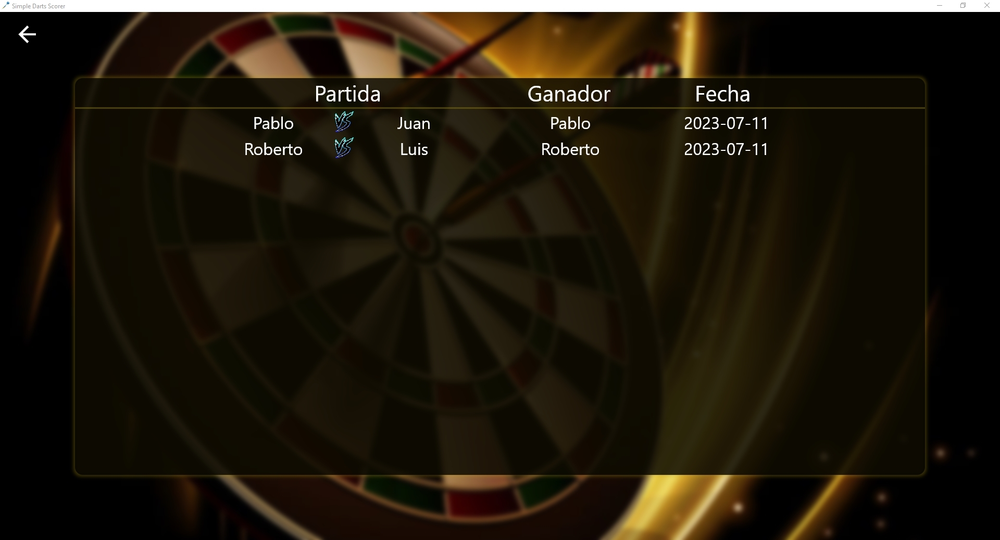

# Simple Darts Scorer

## Características
 - Posibilidad de gestionar una partida de dardos 501 entre 2 jugadores
 - Sistema de guardado de partida automática y posibilidad de continuarla
 - Historial de partidas

## Capturas de pantalla

## Funcionamiento
El repositorio contiene tanto el código de la aplicación como un instalador, tan sólo ejecútalo 
si quieres instalar la aplicación en windows
